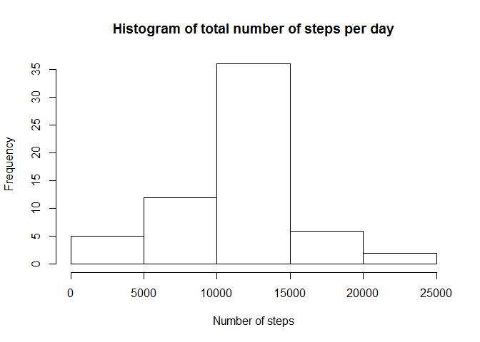

# Reproducible Research: Peer Assessment 1

## Loading and preprocessing the data

The first step is to load the data into R. The table is stored in "a".


```r
a <- read.csv("activity.csv")
head(a)
```

```
##   steps       date interval
## 1    NA 2012-10-01        0
## 2    NA 2012-10-01        5
## 3    NA 2012-10-01       10
## 4    NA 2012-10-01       15
## 5    NA 2012-10-01       20
## 6    NA 2012-10-01       25
```

## What is mean total number of steps taken per day?

The first set of tasks are:

1. Calculate the total number of steps taken per day
2. Make a histogram of the total number of steps taken each day
3. Calculate and report the mean and median of the total number of steps taken per day

tapply was used to sum the number of steps over each day. The result is stored in "b".


```r
b <- tapply(a$steps, a$date, sum, na.rm=TRUE)
head(b)
```

```
## 2012-10-01 2012-10-02 2012-10-03 2012-10-04 2012-10-05 2012-10-06 
##          0        126      11352      12116      13294      15420
```

```r
hist(b, main="Histogram of total number of steps per day", xlab="Number of steps")
```

 

```r
mean(b)
```

```
## [1] 9354.23
```

```r
median(b)
```

```
## [1] 10395
```

The mean number of steps is 9354.23  
The median number of steps is 10395

## What is the average daily activity pattern?

1. Make a time series plot (i.e. type = "l") of the 5-minute interval (x-axis) and the average number of steps taken, averaged across all days (y-axis)
2. Which 5-minute interval, on average across all the days in the dataset, contains the maximum number of steps?

tapply was used to average the number of steps over each interval. The result is stored in "c".


```r
c <- tapply(a$steps, a$interval, mean, na.rm=TRUE)
head(c)
```

```
##         0         5        10        15        20        25 
## 1.7169811 0.3396226 0.1320755 0.1509434 0.0754717 2.0943396
```

```r
plot(as.numeric(names(c)),c,type="l", xlab="5 minute interval", ylab="average # of steps", main="Average Daily Activity Pattern")
```

 

```r
names(c)[which.max(unname(c))]
```

```
## [1] "835"
```

835 is the 5-minute interval with the maximum average number of steps. 

## Inputing missing values

1. Calculate and report the total number of missing values in the dataset (i.e. the total number of rows with NAs)
2. Devise a strategy for filling in all of the missing values in the dataset. The strategy does not need to be sophisticated. For example, you could use the mean/median for that day, or the mean for that 5-minute interval, etc.
3. Create a new dataset that is equal to the original dataset but with the missing data filled in.
4. Make a histogram of the total number of steps taken each day and Calculate and report the mean and median total number of steps taken per day. Do these values differ from the estimates from the first part of the assignment? What is the impact of imputing missing data on the estimates of the total daily number of steps?


```r
sum(is.na(a$steps) | is.na(a$date) | is.na(a$interval))
```

```
## [1] 2304
```

```r
sum(is.na(a$steps))
```

```
## [1] 2304
```

```r
sum(is.na(a$date))
```

```
## [1] 0
```

```r
sum(is.na(a$interval))
```

```
## [1] 0
```

There are 2304 rows with missing values. Note that "steps" is the only column with missing values. I filled in the missing values with the mean for that 5-minute interval, rounded to the nearest integer. The new table is named "d".


```r
d <- a
for (i in 1:dim(d)[1]) {
    if(is.na(d$steps[i])) {
        d$steps[i] <- round(unname(c[toString(d$interval[i])]))
    }
}
head(d)
```

```
##   steps       date interval
## 1     2 2012-10-01        0
## 2     0 2012-10-01        5
## 3     0 2012-10-01       10
## 4     0 2012-10-01       15
## 5     0 2012-10-01       20
## 6     2 2012-10-01       25
```

tapply was used again like before. The result is stored in "e".


```r
e <- tapply(d$steps, d$date, sum)
hist(e, main="Histogram of total number of steps per day", xlab="Number of steps")
```

 

```r
mean(e)
```

```
## [1] 10765.64
```

```r
median(e)
```

```
## [1] 10762
```

For the new dataset,  
The mean number of steps is 10765.64  
The median number of steps is 10762  
The values are slightly larger than before. The missing values were treated as zeroes, which made the original dataset smaller. 

## Are there differences in activity patterns between weekdays and weekends?

Use the dataset with the filled-in missing values for this part.  

1. Create a new factor variable in the dataset with two levels - "weekday" and "weekend" indicating whether a given date is a weekday or weekend day.
2. Make a panel plot containing a time series plot (i.e. type = "l") of the 5-minute interval (x-axis) and the average number of steps taken, averaged across all weekday days or weekend days (y-axis). 


```r
for (i in 1:dim(d)[1]) {
    if (is.element(weekdays(as.Date(d$date[i])),c("Saturday","Sunday"))) {
        d$typeofday[i] <- "weekend"
    } else {
        d$typeofday[i] <- "weekday"
    }
}
head(d)
```

```
##   steps       date interval typeofday
## 1     2 2012-10-01        0   weekday
## 2     0 2012-10-01        5   weekday
## 3     0 2012-10-01       10   weekday
## 4     0 2012-10-01       15   weekday
## 5     0 2012-10-01       20   weekday
## 6     2 2012-10-01       25   weekday
```

The data frame "d" is split into two, "day" and "end", containing the data for the weekdays and weekends, respectively. 


```r
f <- split(d,d$typeofday)
day <- f[[1]]
end <- f[[2]]
head(day)
```

```
##   steps       date interval typeofday
## 1     2 2012-10-01        0   weekday
## 2     0 2012-10-01        5   weekday
## 3     0 2012-10-01       10   weekday
## 4     0 2012-10-01       15   weekday
## 5     0 2012-10-01       20   weekday
## 6     2 2012-10-01       25   weekday
```

```r
head(end)
```

```
##      steps       date interval typeofday
## 1441     0 2012-10-06        0   weekend
## 1442     0 2012-10-06        5   weekend
## 1443     0 2012-10-06       10   weekend
## 1444     0 2012-10-06       15   weekend
## 1445     0 2012-10-06       20   weekend
## 1446     0 2012-10-06       25   weekend
```

```r
dayave <- tapply(day$steps, day$interval, mean)
endave <- tapply(end$steps, end$interval, mean)
head(dayave)
```

```
##          0          5         10         15         20         25 
## 2.28888889 0.40000000 0.15555556 0.17777778 0.08888889 1.57777778
```

```r
head(endave)
```

```
##    0    5   10   15   20   25 
## 0.25 0.00 0.00 0.00 0.00 3.50
```

```r
par(mfrow=c(2,1))
plot(as.numeric(names(dayave)),dayave,type="l", xlab="5 minute interval", ylab="average # of steps", main="weekday")
plot(as.numeric(names(endave)),endave,type="l", xlab="5 minute interval", ylab="average # of steps", main="weekend")
```

 
